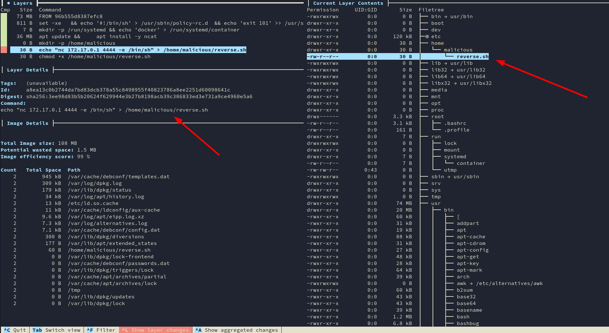

# Exploitation de vulnérabilité Docker

## 1. Analsye d'image docker

Imaginez que nous avons téléchargé une image et que nous voulons la lancer sans aucune vérification.


Nous pouvons voir qu'un attaquant peut simplement obtenir un shell sur votre conteneur.

[Dive](https://github.com/wagoodman/dive) est un outil pour faire du reverse engineering sur une image Docker. 

Nous devons télécharger l'image avant de l'analyser, puis prendre l'ID de l'image comme argument pour `dive`.

```
╰─➤  docker images                                                           
REPOSITORY                 TAG             IMAGE ID       CREATED         SIZE
mydockerimage              latest          00571c260cae   2 minutes ago   108MB


╰─➤  dive 00571c260cae
```


### 1. Layers (rouge)
    Cette fenêtre montre les différentes couches et étapes de l'image, des informations telles que l'ID de la couche et toute commande exécutée dans le conteneur.

### 2. Image details (bleu)
    De nombreuses informations et détails sur l'image tels que la taille.

### 3. Current Layer Contents (vert)
    Tout le contenu du système de fichiers du conteneur au niveau de la couche sélectionnée.

Vous pouvez naviguer entre les fenêtres en utilisant "Tab" et "Up" et "Down" pour les données.



Prenons l'exemple d'une image malveillante, ici nous pouvons voir à la 7ème couche la commande pour le reverse shell. \
N'oubliez donc pas de vérifier toutes les couches avant d'exécuter une image !

***

## 2. Docker Daemon Exposé 

### <u>Premier cas : nous sommes à l'extérieur d'un conteneur</u>

Imaginez qu'un attaquant ait réussi à obtenir un shell sur la machine, mais que nous ayons bien (presque) configuré l'utilisateur et qu'il ne puisse rien faire.
Mais, si le Daemon est exposé et que l'utilisateur a le groupe docker : 


```
hellodocker@ubuntu:~$ find / -name docker.sock 2>/dev/null
  /run/docker.sock
hellodocker@ubuntu:~$ groups 
  hellodocker docker
```


Cette commande permet de monter le répertoire "/" de l'hôte dans le répertoire "/mnt" d'un nouveau conteneur, de le "chrooter" puis de se connecter via un shell. Une commande simple qui donne un accès root à l'attaquant. On peut utiliser l'image que l'on veut, une image locale ou télécharger une image s'il y a une connexion internet.

<br>

### <u>Deuxième cas : nous sommes à l'intérieur d'un conteneur</u>

L'idée est la même que précédemment, si l'utilisateur à l'intérieur du conteneur a un démon docker exposé, nous pouvons échapper au conteneur.

> docker run -v /:/mnt --rm -it alpine chroot /mnt sh

Et nous avons un shell root sur la machine hôte, nous sommes sortis du conteneur.

***

## 3. Mauvaise configuration des Privileges et Capabilities

Les conteneurs Docker permettent de démarrer sans accès root mais avec certains privilèges et capacités. \
Par défaut, les conteneurs démarrent avec ces capacités, qui ne sont pas nécessaires et qui ne devraient pas être utilisées en prod :

  - CAP_AUDIT_WRITE 
  - CAP_CHOWN
  - CAP_DAC_OVERRIDE
  - CAP_FOWNER
  - CAP_FSETID
  - CAP_KILL
  - CAP_NET_BIND_SERVICE
  - CAP_NET_RAW
  - CAP_MKNOD
  - CAP_SETFC
  - CAP_SETCAP
  - CAP_SETUID/CAP_SETGID
  - CAP_SYS_CHROOT
  
Vous pouvez lister les capacités à l'intérieur d'un conteneur en utilisant `capsh --print` (apt install libcap2-bin s'il n'existe pas).

La capacité la plus dangereuse est `CAP_SYS_ADMIN` car vous pourrez monter des fichiers du système d'exploitation hôte dans le conteneur.


Un conteneur serait vulnérable à cette technique s'il est exécuté avec les arguments : 

> --security-opt apparmor=unconfined --cap-add=SYS_ADMIN

## 3.1 Je suis Root

Les conteneurs docker bien configurés n'autorisent pas de commande comme `fdisk -l`. Cependant, si le container Docker est mal configuré et que l'argument `--privileged` est spécifié, il est possible d'obtenir les privilèges nécessaires pour voir le disque hôte.


Nous pouvons voir **/dev/sda5** qui est la partition du système hôte.


Nous pouvons maintenant lire les fichiers du système hôte.

## 4. Shared Namespaces

TODO

## Bonus : Déterminer si nous sommes dans un container

### <u>Méthode 1 : processes </u>

Les conteneurs ont souvent très peu de processus en cours, lancez un `ps faux` pour les voir.


### <u>Méthode 2 : dockerenv </u>

Les conteneurs Docker autorisent les variables d'environnement fournies par l'hôte, à l'aide d'un fichier **.dockerenv**. \
Vous pouvez trouver ce fichier dans **/**. Ce fichier est créé même si l'hôte ne fournit pas de variable env.


### <u>Méthode 3 : cgroup </u>

Les Cgroups sont utilisés par les conteneurs tels que Docker. Vous les trouverez dans **/proc/1/cgroup**.


## Automatisation 

Vous pouvez lancer des scripts pour voir si vous êtes vulnérable à un échappement de docker ou à une autre mauvaise configuration.

## À l'intérieur d'un container : 

- [Deepce](https://github.com/stealthcopter/deepce/)
  Docker Enumeration, Escalation of Privileges and Container Escapes (DEEPCE)

- [LinPEAS](https://github.com/carlospolop/privilege-escalation-awesome-scripts-suite/tree/master/linPEAS) 
  Local Enumeration for Privileges Escalation, with a dedicated part for docker containers. \
  EX : 
```
═════════════════════════════════════════╣ Containers ╠══════════════════════════════════════════
[+] Is this a container? ........... docker
[+] Container related tools present
[+] Any running containers? ........ No
[+] Am I inside Docker group ....... No
[+] Looking and enumerating Docker Sockets
[+] Docker version ................. Not Found
[+] Vulnerable to CVE-2019-5736 .... Not Found
[+] Vulnerable to CVE-2019-13139 ... Not Found
[+] Rooless Docker? ................ No

[+] Container & breakout enumeration
[i] https://book.hacktricks.xyz/linux-unix/privilege-escalation/docker-breakout
[+] Container ID ................... docker.escape
[+] Container Full ID .............. e061eb6346e7386a054548e1c5639f3742b35f9356937b946f2f5da8779aba4f
[+] Vulnerable to CVE-2019-5021 .. No

[+] Container Capabilities
Current: = cap_chown,cap_dac_override,cap_dac_read_search,cap_fowner,cap_fsetid,cap_kill,cap_setgid,cap_setuid,cap_setpcap,cap_linux_immutable,cap_net_bind_service,cap_net_broadcast,cap_net_admin,cap_net_raw,cap_ipc_lock,cap_ipc_owner,cap_sys_module,cap_sys_rawio,cap_sys_chroot,cap_sys_ptrace,cap_sys_pacct,cap_sys_admin,cap_sys_boot,cap_sys_nice,cap_sys_resource,cap_sys_time,cap_sys_tty_config,cap_mknod,cap_lease,cap_audit_write,cap_audit_control,cap_setfcap,cap_mac_override,cap_mac_admin,cap_syslog,cap_wake_alarm,cap_block_suspend,cap_audit_read+eip
Bounding set =cap_chown,cap_dac_override,cap_dac_read_search,cap_fowner,cap_fsetid,cap_kill,cap_setgid,cap_setuid,cap_setpcap,cap_linux_immutable,cap_net_bind_service,cap_net_broadcast,cap_net_admin,cap_net_raw,cap_ipc_lock,cap_ipc_owner,cap_sys_module,cap_sys_rawio,cap_sys_chroot,cap_sys_ptrace,cap_sys_pacct,cap_sys_admin,cap_sys_boot,cap_sys_nice,cap_sys_resource,cap_sys_time,cap_sys_tty_config,cap_mknod,cap_lease,cap_audit_write,cap_audit_control,cap_setfcap,cap_mac_override,cap_mac_admin,cap_syslog,cap_wake_alarm,cap_block_suspend,cap_audit_read
Securebits: 00/0x0/1'b0
 secure-noroot: no (unlocked)
 secure-no-suid-fixup: no (unlocked)
 secure-keep-caps: no (unlocked)
uid=0(root)
gid=0(root)

[+] Privilege Mode is disabled
```

## À l'extérieur d'un container 

- [Docker-Bench-Security](https://github.com/docker/docker-bench-security) : The Docker Bench for Security is a script that checks for dozens of common best-practices around deploying Docker containers in production. 